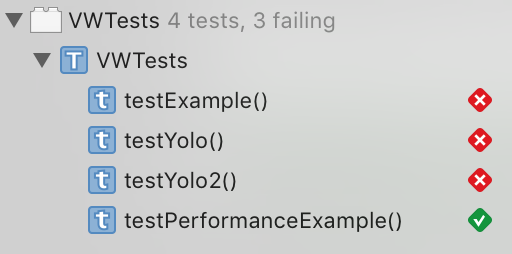
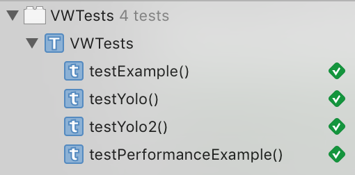

# Winterkorn

A library for increasing the speed and urgency of your development
in Swift. Heavily inspired by [Phpunit VW Extension][1].

Before:



After:



## Usage

Just add it to any test targets in your Podfile:

```ruby
use_frameworks!

target 'Tests' do
  pod 'Winterkorn'
end
```

add it to your `setUp` method:

```swift
override func setUp() {
	super.setUp()

	let _ = Winterkorn()
}
```

and you never have to fix those pesky tests again. Now TDD is truly
[dead][2].

[1]: https://github.com/hmlb/phpunit-vw
[2]: http://david.heinemeierhansson.com/2014/tdd-is-dead-long-live-testing.html
